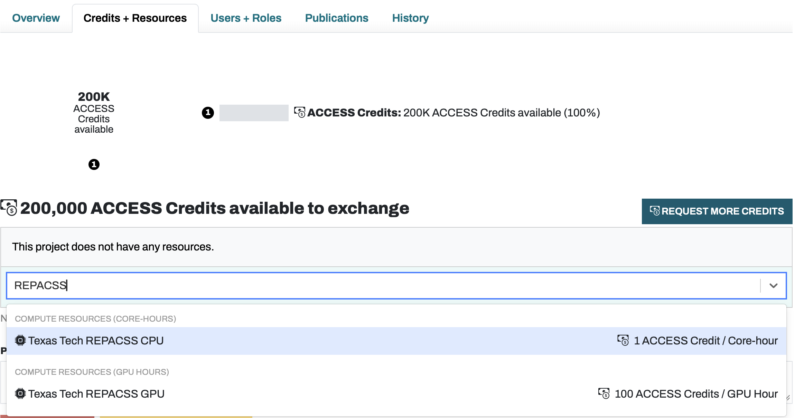
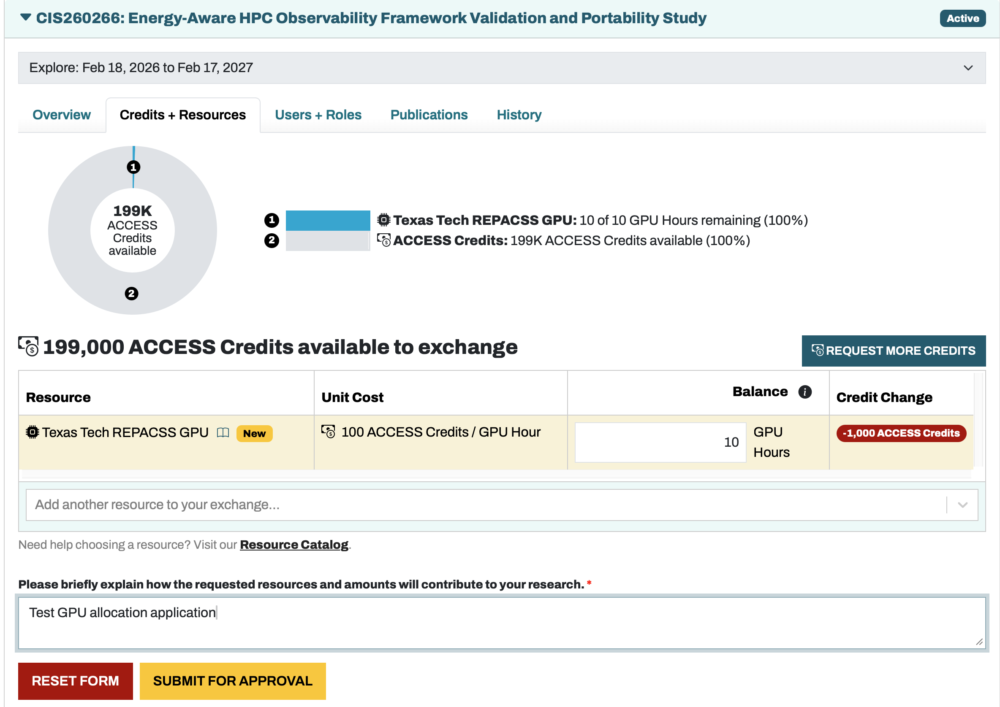
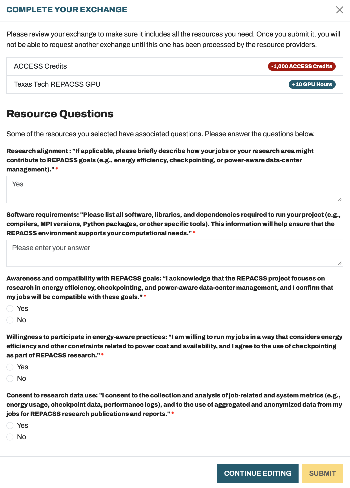

# ACCESS Accounts

## What is ACCESS?

[ACCESS](https://access-ci.org) is a U.S. [U.S. National Science Foundation (NSF)](https://nsf.gov) program that provides researchers with access to advanced computational resources, support services, and training. REPACSS aims to integrate with ACCESS in the future to:

- Expand national access to REPACSS resources
- Support collaboration across U.S. institutions

To get ACCESS resources, follow the instructions on [Get Your First Project](https://allocations.access-ci.org/get-your-first-project) to apply. Key steps for applying REPACSS resources are highlighted below.

!!! warning "Group-Based Allocation: New REPACSS Users"
    REPACSS uses **Hammerspace Storage** with **Group-Based Allocation**. Although ACCESS allows anyone to apply for projects and REPACSS resources independently, REPACSS manages storage and access by research groups.

    **For new REPACSS users**, the initial setup must be completed by a **Research Group director (faculty)**. The director must:

    - Apply as the project lead with **faculty** identity
    - Describe the **intended use** of REPACSS resources
    - Provide **group information** and **initial group member list** in the application

    REPACSS will use this information to create the new group and member accounts. Once the group exists, additional members can be added through the normal ACCESS workflow.

## Step-by-Step Guide

### 1. Register New Account

Follow [New User Registration](https://operations.access-ci.org/identity/new-user) to register an ACCESS account with your university identity.

### 2. Choose the Project Type

[Project Types](https://allocations.access-ci.org/project-types) describes four different allocation types, each corresponding to ACCESS credits that you can redeem for CPU/GPU hours on REPACSS. As ACCESS recommends, you can start with an "Explore" or "Discover" project first and upgrade if needed.

### 3. Redeem Credits for REPACSS Resources

Go to your project's **Credits + Resources** tab to exchange ACCESS credits for REPACSS compute resources.

**Pricing:** REPACSS charges **1 ACCESS Credit per CPU core-hour** and **100 ACCESS Credits per GPU hour**. Search for "REPACSS" in the resource selector to find Texas Tech REPACSS CPU and GPU options.

**Request resources:** Enter the desired quantity (e.g., 10 GPU Hours), provide a brief justification for your research, then click **SUBMIT FOR APPROVAL**. *If you are a new REPACSS group director*, include your group name and initial member list in the justification so REPACSS can provision the group.

**Resource Questions:** REPACSS is a research-oriented data center. Before submitting, you must answer several questions to align with our research goals (energy efficiency, checkpointing, power-aware data-center management). Complete all required fields in the "Complete Your Exchange" dialog.

Once your request is approved, the allocated resources will appear on your account.

!!! info "How Allocations Are Applied"
    REPACSS currently manages allocations on a **group basis**, not at the individual user level. Your personal ACCESS allocation request is treated equivalently to a group allocation request: approved CPU/GPU hours are added to your **group's quota**, not assigned to your individual account. All group members share the group's allocation.

    We are considering extending our QoS policies in the future to support individual user allocations and per-user Slurm runtime quotas, but this is not expected to be implemented in the near term.