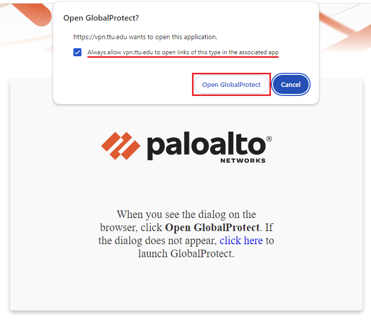
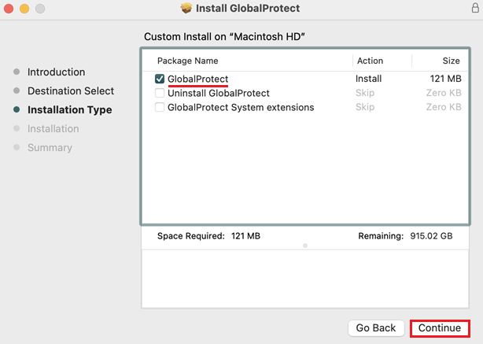
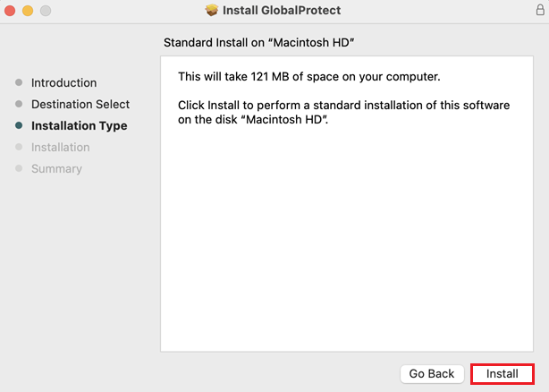
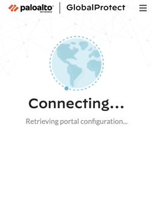

# 🔐 VPN Setup Guide for REPACSS

> **Note:** Access to the REPACSS HPC system requires a secure connection via the **GlobalProtect VPN**, regardless of whether you're on or off campus. All users must also have **Microsoft MFA** enabled.

---

## Overview

To connect to REPACSS (`repacss.ttu.edu`), you must be:
- Using the **vpn.ttu.edu** portal
- Logged into your **eRaider account**
- Authenticated via **Microsoft Multi-Factor Authentication (MFA)**

This guide provides setup instructions for:

- 🪟 Windows  
- 🍎 macOS  
- 🐧 Linux

---

## 📌 Step 1: Request VPN Access

Before installing the GlobalProtect VPN client:

1. Go to the [TTU VPN Request Form](https://askit.ttu.edu/sp?id=sc_cat_item&sys_id=a990ee5ddbdf41144d17266e139619f8)
!!! tip
    Don't forget to sign-in to your TTU account in ServiceNow
2. Under “Type of Assistance,” select `Enable`
3. For the reason, enter:  
   ```
   Need TTUnet VPN to access REPACSS TTU Cluster
   ```
4. Ensure [Microsoft MFA](https://askit.ttu.edu/sp?id=sc_cat_item&sys_id=77057d80874eb5509a3a539d3fbb35ed) is set up and functional

---

## 🪟 Windows Setup

### Install GlobalProtect

1. Visit the [TTU Software Portal](https://software.ttu.edu/)
2. Download the appropriate `.msi` for your system (32-bit or 64-bit)
3. Run the installer and follow on-screen instructions:
    - 
    - 
    - 
    - 
    - 
    - 
    - 
    - 

### Connect to VPN

1. Launch **GlobalProtect** from the Notification Area
2. Enter the portal address:
   ```
   vpn.ttu.edu
   ```
3. Click **Connect**
4. Log in using your eRaider credentials and approve MFA:
    - 
    - 
    - 
    - 

---

## 🍎 macOS Setup

### Install GlobalProtect

1. Download the `.pkg` installer from [software.ttu.edu](https://software.ttu.edu/)
2. Run the installer and follow prompts:
    - 
    - 
    - 
    - 
    - 
    - 
    - 
    - 
    - 

### Connect to VPN

1. Open **GlobalProtect** from the menu bar:
    - 
2. Enter the portal:
   ```
   vpn.ttu.edu
   ```
3. Click **Connect**
4. Authenticate using eRaider and MFA:
    - 
    - 
    - 
    - 
    - 

---

## 🐧 Linux Setup

### Install Dependencies (Ubuntu)

```bash
sudo apt-get update
sudo apt-get install libc6 libstdc++6 libpam0g libx11-6 libxcb1 \
libxcomposite1 libxcursor1 libxdamage1 libxext6 libxfixes3 libxi6 \
libxrandr2 libxrender1 libxtst6 libnss3 libgtk-3-0
```

### Install GlobalProtect

1. Visit [software.ttu.edu](https://software.ttu.edu/global-protect)
2. Download the `.deb` or `.rpm` file

Install:

**Ubuntu/Debian**
```bash
sudo dpkg -i GlobalProtect_<version>_amd64.deb
```

**CentOS/RHEL**
```bash
sudo rpm -i GlobalProtect_<version>_x86_64.rpm
```

---

### Connect to VPN

```bash
globalprotect launch-ui
```

1. Enter the portal:
   ```
   vpn.ttu.edu
   ```
2. Click **Connect**
3. Authenticate with eRaider + MFA

Check connection status:
```bash
globalprotect show --status
```

You should see:
```
Status: Connected
```

---

## 🧰 Troubleshooting

### 🔑 Login or MFA Fails
- Double-check eRaider and MFA
- Clear browser cookies
- Try in private/incognito mode

### 🌐 Cannot Connect
- Ensure correct portal `vpn.ttu.edu`
- Restart your machine or GlobalProtect
- Allow GlobalProtect through your firewall

### 🔧 Installation Issues
- Use admin privileges
- Check system compatibility
- Re-download from the TTU Software Portal

---

## ✅ Disconnect from VPN

**Windows/macOS**  
Click GlobalProtect tray/menu icon → Click **Disconnect**

**Linux**
```bash
globalprotect disconnect
```

---

## 🔗 Related Resources

- [Getting Started](../getting-started-at-REPACSS.md)
- [Running Jobs](../running-jobs/basics.md)

---

_Last updated: June 12, 2025_
