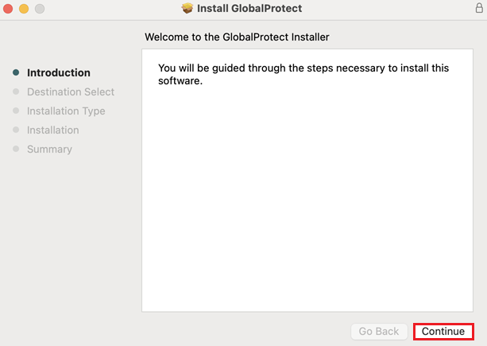
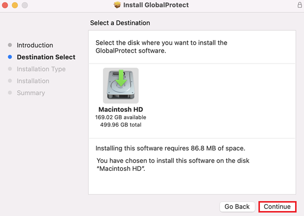
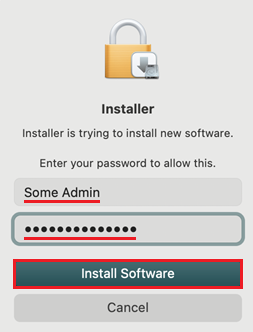
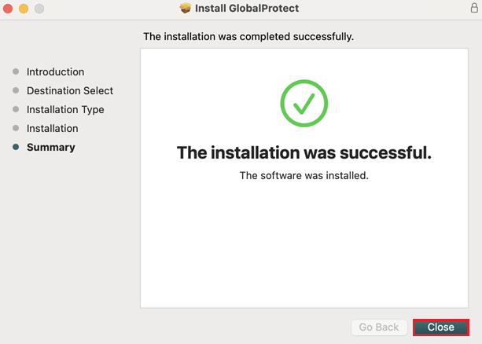
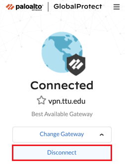

# VPN Setup Guide for macOS

## Overview {#overview}
This guide provides detailed instructions for setting up and using the GlobalProtect VPN on macOS systems to access REPACSS resources. The VPN connection is required for all users, regardless of whether they are on-campus or off-campus.

## Prerequisites {#prerequisites}
- Valid TTU eRaider account
- Administrator privileges on your Mac
- Microsoft Multi-Factor Authentication (MFA) configured
- Internet connection
- At least 100MB of free disk space

## Installation Steps {#installation}

### 1. Request VPN Access {#request-access}
1. Complete the [VPN request form](https://askit.ttu.edu/sp?id=sc_cat_item&sys_id=a990ee5ddbdf41144d17266e139619f8)
2. Under **Type of Assistance**, select **Enable**
3. For the reason, enter: "Need TTUnet VPN to access REPACSS"
4. Ensure you have configured [Microsoft Multi-Factor Authentication (MFA)](https://askit.ttu.edu/sp?id=sc_cat_item&sys_id=77057d80874eb5509a3a539d3fbb35ed)

### 2. Download and Install {#download-install}
1. Download the GlobalProtect installation package from the [eRaider Software Downloads page](https://software.ttu.edu/) 
 

2. Locate and open the downloaded file (typically in Downloads folder)
3. Click Continue to begin the installation process 
 

4. Select the installation destination disk 
 

5. Select the checkbox labeled "GlobalProtect" 
 

6. Click Install to proceed 
 

7. When prompted, use Touch ID or enter administrator credentials 
 
 

8. Allow Installer access to your Downloads folder if prompted 
 

9. Click Close when installation is complete 
 

10. Choose whether to keep or move the installation package to trash 
 

11. Configure notification preferences when prompted 
 
 

## Connecting to VPN {#connecting}

### 1. Launch GlobalProtect {#launch}
1. Click the GlobalProtect icon in your Mac's menu bar 
 

2. In the Portal field, enter: `vpn.ttu.edu`
3. Click Connect 
 

### 2. Authentication {#authentication}
1. Wait while GlobalProtect retrieves the configuration 
 

2. Your default browser will open automatically for sign-in 
 

3. If browser doesn't open automatically, launch it manually
4. Sign in with your eRaider credentials
5. Click "Open GlobalProtect.app" when prompted 
 

6. If prompted regarding PanGPS, enter administrator credentials 
 

### 3. Verify Connection {#verify}
1. Wait while the VPN connection is established
2. The GlobalProtect icon will indicate an active connection 
 

## Disconnecting from VPN {#disconnecting}

### 1. Disconnect {#disconnect}
1. Click the GlobalProtect icon in the menu bar 
 

2. Click Disconnect 
 

3. Wait while the VPN connection is terminated 
 

## Important Notes {#notes}
> **Important**: VPN connection is mandatory for all REPACSS access

- Keep your GlobalProtect client updated
- Use the official TTU VPN portal only
- Allow GlobalProtect in System Preferences > Security & Privacy if prompted
- The TTUnet VPN service provides a secure connection to the Texas Tech University (TTU) network only
- It is not designed for general-purpose internet encryption

## Troubleshooting {#troubleshooting}
### Common Issues
1. **Installation Fails**
   - Ensure you have administrator privileges
   - Check System Preferences > Security & Privacy
   - Allow installation from identified developers
   - Clear temporary files
   - Try downloading the installer again

2. **Connection Issues**
   - Verify MFA is properly configured
   - Check network settings
   - Ensure correct portal address (vpn.ttu.edu)
   - Restart GlobalProtect
   - Check System Preferences > Security & Privacy settings

3. **Authentication Problems**
   - Verify eRaider credentials
   - Check MFA status
   - Clear browser cache and cookies
   - Check System Preferences > Security & Privacy settings

4. **Performance Issues**
   - Check system resources
   - Verify network speed
   - Close unnecessary applications
   - Restart your Mac if problems persist

## Related Resources {#resources}
- [Main VPN Setup Guide](vpn-setup.md)
- [Getting Started Guide](../getting-started.md)

## Next Steps {#next}
1. Verify VPN connection
2. Proceed to [Getting Started](../getting-started.md)
3. Learn about [Running Jobs](../running-jobs.md)

---

*Last updated: June 5, 2025* 