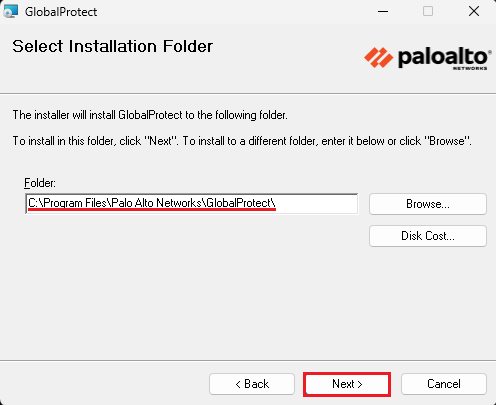
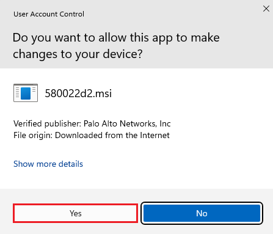
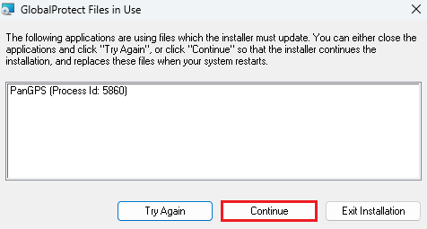

# 🪟 VPN Setup Guide for Windows

## Overview

This guide explains how to install and use **GlobalProtect VPN** on Windows systems to access REPACSS. The VPN is required for **all users**, regardless of their location.

---

## ✅ Prerequisites

- TTU **eRaider account**
- **Microsoft Multi-Factor Authentication (MFA)** enabled
- Administrator privileges on your computer
- Active internet connection
- At least **100MB** of free disk space

---

## 📝 Step 1: Request VPN Access

1. Go to the [VPN request form](https://askit.ttu.edu/sp?id=sc_cat_item&sys_id=a990ee5ddbdf41144d17266e139619f8)
2. Select **Enable** under “Type of Assistance”
3. For the reason, enter:  
   `Need TTUnet VPN to access REPACSS`
4. Set up [Microsoft MFA](https://askit.ttu.edu/sp?id=sc_cat_item&sys_id=77057d80874eb5509a3a539d3fbb35ed) if not already configured

---

## 💾 Step 2: Download & Install GlobalProtect

1. Download the installer from the [TTU Software Portal](https://software.ttu.edu/)
2. Open the downloaded `.msi` file from your Downloads folder
   
3. Choose the appropriate version for your system (32-bit or 64-bit)
4. Click **Next** to start the installation  
   
5. Select an installation folder  
   
6. Confirm settings and click **Next**  
   
7. Click **Yes** on the User Account Control prompt  
   
8. If prompted about files in use, click **Continue**  
   
9. Wait for installation to complete  
   
10. Click **Close**  
   
11. Restart your PC (recommended)  
   

---

## 🔌 Step 3: Connect to VPN

### Launch GlobalProtect
1. Click the GlobalProtect icon in the **Notification Area** (bottom-right)
2. If not visible, click the **upward arrow (˄)** to reveal hidden icons  
   

### Configure Connection
1. In the GlobalProtect window, enter the portal address:  
   ```
   vpn.ttu.edu
   ```
2. Click **Connect**  
   

### Authenticate
1. A browser will open for login
2. If it doesn’t, open your default browser manually
3. Sign in with your eRaider credentials
4. When prompted, click **Open GlobalProtect**  
   
5. Wait for the connection to establish  
   

---

## 🔌 Disconnect from VPN

### Disconnect Safely
1. Click the GlobalProtect icon again  
   
2. Click **Disconnect**  
   

---

## ⚠️ Important Notes

> **VPN is mandatory for all access to REPACSS**

- Always use the portal: `vpn.ttu.edu`
- Keep GlobalProtect updated
- Allow GlobalProtect through Windows Firewall
- VPN is for TTU resources only—not for general internet browsing

---

## 🧰 Troubleshooting

### 🔧 Installation Fails
- Use administrator privileges
- Temporarily disable antivirus
- Run Windows Update
- Re-download installer if needed
- Clear temporary files

### 🌐 Connection Issues
- Check MFA setup
- Verify firewall settings
- Confirm correct portal address
- Restart GlobalProtect service
- Check your network adapter

### 🔑 Authentication Errors
- Ensure eRaider login is valid
- Re-check MFA status
- Clear browser cache & cookies
- Inspect Windows Credential Manager

### 🐢 Performance Issues
- Monitor RAM and CPU usage
- Test your internet speed
- Restart your device if needed
- Close unnecessary applications

---

## 🔗 Related Resources

- [Main VPN Setup Guide](vpn-setup.md)
- [Getting Started](../getting-started.md)

---

## 🚀 Next Steps

1. Verify you're connected to the VPN
2. Go to [Getting Started](../getting-started.md) to begin using REPACSS
3. Learn how to [Submit Jobs](../running-jobs.md)

---

_Last updated: June 5, 2025_
