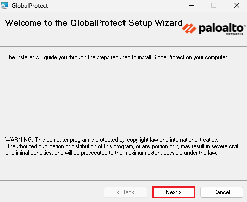
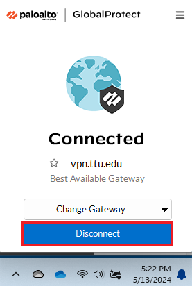

# VPN Setup Guide for Windows

## Overview {#overview}
This guide provides detailed instructions for setting up and using the GlobalProtect VPN on Windows systems to access REPACSS resources. The VPN connection is required for all users, regardless of whether they are on-campus or off-campus.

## Prerequisites {#prerequisites}
- Valid TTU eRaider account
- Administrator privileges on your computer
- Microsoft Multi-Factor Authentication (MFA) configured
- Internet connection
- At least 100MB of free disk space

## Installation Steps {#installation}

### 1. Request VPN Access {#request-access}
1. Complete the [VPN request form](https://askit.ttu.edu/sp?id=sc_cat_item&sys_id=a990ee5ddbdf41144d17266e139619f8)
2. Under **Type of Assistance**, select **Enable**
3. For the reason, enter: "Need TTUnet VPN to access REPACSS"
4. Ensure you have configured [Microsoft Multi-Factor Authentication (MFA)](https://askit.ttu.edu/sp?id=sc_cat_item&sys_id=77057d80874eb5509a3a539d3fbb35ed)

### 2. Download and Install {#download-install}
1. Download the GlobalProtect software from the [IT Online Software Store](https://software.ttu.edu/)
2. Locate and open the downloaded file (typically in Downloads folder)
3. Select the correct version based on your system type (64-bit or 32-bit Windows)

4. Click Next to begin installation

5. Select the installation folder

6. Click Next to confirm and proceed

7. Click Yes if prompted by User Account Control

8. Click Continue if prompted about GlobalProtect files being in use

9. Wait for the installation to complete

10. Click Close when finished

11. Restart your computer if prompted (recommended)

## Connecting to VPN {#connecting}

### 1. Launch GlobalProtect {#launch}
1. Click the GlobalProtect icon in the Notification Area (bottom right of screen)
2. If the icon isn't visible, click the upward arrow (˄) to reveal hidden icons

### 2. Configure Connection {#configure}
1. In the GlobalProtect window, enter the portal address: `vpn.ttu.edu`
2. Click Connect

### 3. Authentication {#authentication}
1. Your default browser will open automatically for sign-in
2. If browser doesn't open automatically, open it manually
3. Sign in with your eRaider credentials
4. Click "Open GlobalProtect" when prompted by your browser

5. Wait while the VPN connection is established

## Disconnecting from VPN {#disconnecting}

### 1. Disconnect {#disconnect}
1. Click the GlobalProtect icon in the Notification Area

2. Click Disconnect in the GlobalProtect window

## Important Notes {#notes}
> **Important**: VPN connection is mandatory for all REPACSS access

- Keep your GlobalProtect client updated
- Use the official TTU VPN portal only
- Allow GlobalProtect through Windows Firewall if prompted
- The TTUnet VPN service provides a secure connection to the Texas Tech University (TTU) network only
- It is not designed for general-purpose internet encryption

## Troubleshooting {#troubleshooting}
### Common Issues
1. **Installation Fails**
   - Ensure you have administrator privileges
   - Disable antivirus temporarily
   - Check Windows updates
   - Clear temporary files
   - Try downloading the installer again

2. **Connection Issues**
   - Verify MFA is properly configured
   - Check Windows Firewall settings
   - Ensure correct portal address (vpn.ttu.edu)
   - Restart GlobalProtect service
   - Check network adapter settings

3. **Authentication Problems**
   - Verify eRaider credentials
   - Check MFA status
   - Clear browser cache and cookies
   - Check Windows Credential Manager

4. **Performance Issues**
   - Check system resources
   - Verify network speed
   - Close unnecessary applications
   - Restart your computer if problems persist

## Related Resources {#resources}
- [Main VPN Setup Guide](vpn-setup.md)
- [Getting Started Guide](../getting-started.md)

## Next Steps {#next}
1. Verify VPN connection
2. Proceed to [Getting Started](../getting-started.md)
3. Learn about [Running Jobs](../running-jobs.md)

---

*Last updated: June 5, 2025* 